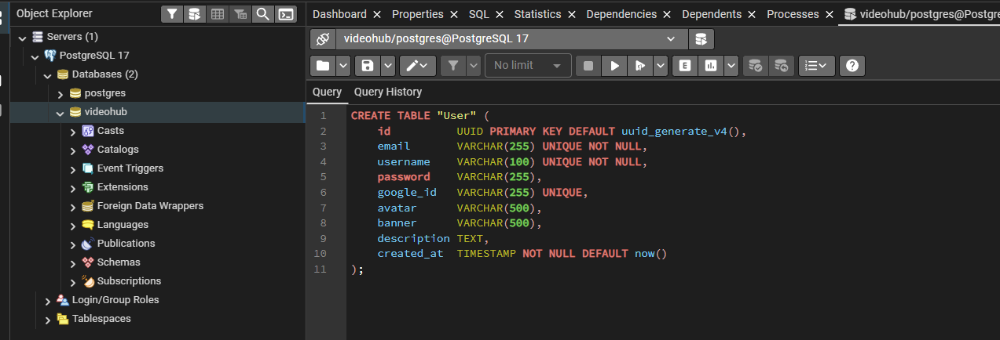
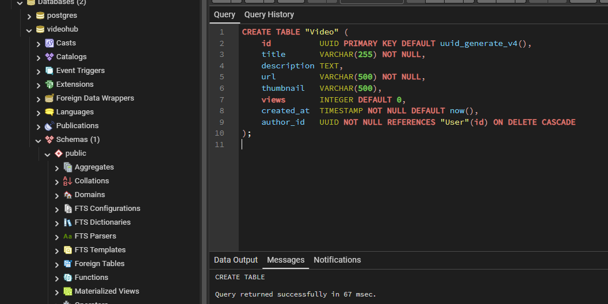
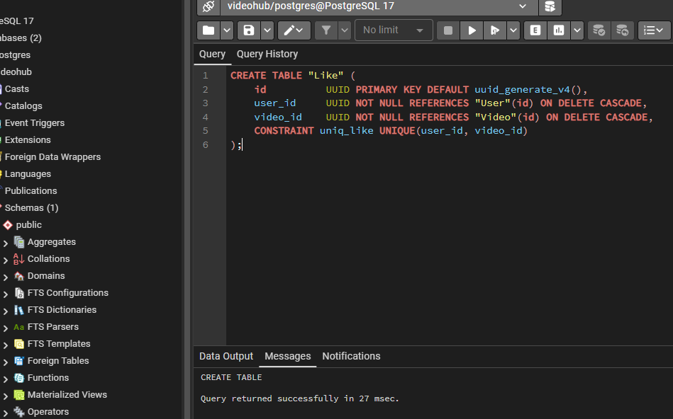
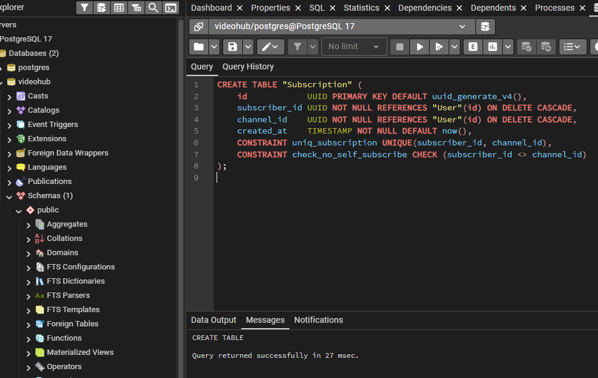
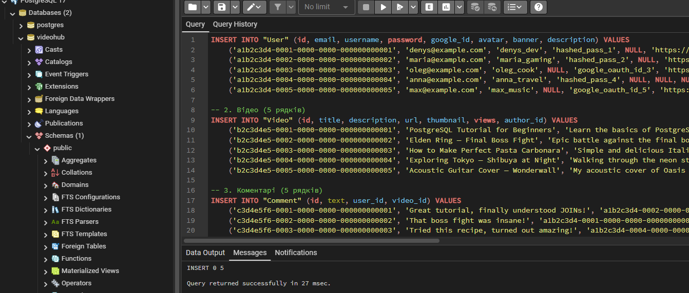
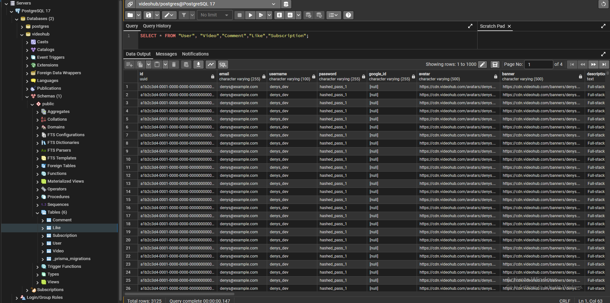

<div style="text-align: center; font-size: 22px; margin-top: 60px;">

Міністерство освіти і науки України

Національний технічний університет України

«Київський політехнічний інститут імені Ігоря Сікорського»

Факультет інформатики та обчислювальної техніки

Кафедра обчислювальної техніки

</div>

<div style="text-align: center; margin-top: 120px;">

<h1 style="font-size: 30px;">Лабораторна робота №2</h1>

<h2 style="font-size: 24px;">з дисципліни «Бази даних»</h2>

</div>

<div style="text-align: right; margin-top: 120px; font-size: 18px;">

<strong>Виконав:</strong><br>
Степаненко Денис<br>
студент групи ІМ-051<br>
номер у списку групи: 16<br><br>

<strong>Перевірив:</strong><br>
Хмельницький Арсеній Андрійович

</div>

<div style="text-align: center; margin-top: 120px; font-size: 22px;">

Київ 2026

</div>

---

## Короткий виклад вимог

**Завдання:**

На основі концептуальної моделі з Lab 1 (ER-діаграми VideoHub) потрібно створити фізичну схему бази даних у PostgreSQL за допомогою DDL-команд (CREATE TABLE) та заповнити таблиці тестовими даними за допомогою DML-команд (INSERT INTO).

**Порядок створення таблиць:**

Спочатку створюються батьківські таблиці (без зовнішніх ключів), потім дочірні (з зовнішніми ключами, що посилаються на батьківські). Це необхідно тому, що PostgreSQL перевіряє існування таблиці, на яку посилається FOREIGN KEY, на момент створення.

1. `User` — без зовнішніх ключів (батьківська таблиця)
2. `Video` — FK author_id → User(id)
3. `Comment` — FK user_id → User(id), FK video_id → Video(id)
4. `Like` — FK user_id → User(id), FK video_id → Video(id)
5. `Subscription` — FK subscriber_id → User(id), FK channel_id → User(id)

---

## DDL: CREATE TABLE

Підключення розширення для генерації UUID:

```sql
CREATE EXTENSION IF NOT EXISTS "uuid-ossp";
```

Таблиця **User** — користувач платформи:

```sql
CREATE TABLE "User" (
    id          UUID PRIMARY KEY DEFAULT uuid_generate_v4(),
    email       VARCHAR(255) UNIQUE NOT NULL,
    username    VARCHAR(100) UNIQUE NOT NULL,
    password    VARCHAR(255),
    google_id   VARCHAR(255) UNIQUE,
    avatar      VARCHAR(500),
    banner      VARCHAR(500),
    description TEXT,
    created_at  TIMESTAMP NOT NULL DEFAULT now()
);
```

Таблиця **Video** — відео, завантажене користувачем:

```sql
CREATE TABLE "Video" (
    id          UUID PRIMARY KEY DEFAULT uuid_generate_v4(),
    title       VARCHAR(255) NOT NULL,
    description TEXT,
    url         VARCHAR(500) NOT NULL,
    thumbnail   VARCHAR(500),
    views       INTEGER DEFAULT 0,
    created_at  TIMESTAMP NOT NULL DEFAULT now(),
    author_id   UUID NOT NULL REFERENCES "User"(id) ON DELETE CASCADE
);
```

Таблиця **Comment** — коментар користувача до відео:

```sql
CREATE TABLE "Comment" (
    id          UUID PRIMARY KEY DEFAULT uuid_generate_v4(),
    text        TEXT NOT NULL,
    created_at  TIMESTAMP NOT NULL DEFAULT now(),
    user_id     UUID NOT NULL REFERENCES "User"(id) ON DELETE CASCADE,
    video_id    UUID NOT NULL REFERENCES "Video"(id) ON DELETE CASCADE
);
```

Таблиця **Like** — лайк користувача на відео:

```sql
CREATE TABLE "Like" (
    id          UUID PRIMARY KEY DEFAULT uuid_generate_v4(),
    user_id     UUID NOT NULL REFERENCES "User"(id) ON DELETE CASCADE,
    video_id    UUID NOT NULL REFERENCES "Video"(id) ON DELETE CASCADE,
    CONSTRAINT uniq_like UNIQUE(user_id, video_id)
);
```

Таблиця **Subscription** — підписка одного користувача на іншого:

```sql
CREATE TABLE "Subscription" (
    id            UUID PRIMARY KEY DEFAULT uuid_generate_v4(),
    subscriber_id UUID NOT NULL REFERENCES "User"(id) ON DELETE CASCADE,
    channel_id    UUID NOT NULL REFERENCES "User"(id) ON DELETE CASCADE,
    created_at    TIMESTAMP NOT NULL DEFAULT now(),
    CONSTRAINT uniq_subscription UNIQUE(subscriber_id, channel_id),
    CONSTRAINT check_no_self_subscribe CHECK (subscriber_id <> channel_id)
);
```

---

## Опис обмежень

**PRIMARY KEY** — кожна таблиця має первинний ключ `id` типу UUID. Значення генерується автоматично через `DEFAULT uuid_generate_v4()`. UUID — це 128-бітний унікальний ідентифікатор, що гарантує глобальну унікальність навіть при об'єднанні даних з різних баз.

**FOREIGN KEY** — зовнішні ключі забезпечують посилальну цілісність (referential integrity). Кожен FK вказує на первинний ключ батьківської таблиці. Обмеження `ON DELETE CASCADE` означає, що при видаленні запису в батьківській таблиці автоматично видаляються всі пов'язані записи в дочірній. Наприклад, при видаленні користувача видаляються всі його відео, коментарі, лайки та підписки.

**UNIQUE** — обмеження унікальності. На таблиці `User` поля `email` та `username` мають UNIQUE — два користувачі не можуть мати однаковий email або нікнейм. Поле `google_id` також UNIQUE, але може бути NULL (користувачі з паролем мають google_id = NULL). На таблиці `Like` складене обмеження `UNIQUE(user_id, video_id)` гарантує, що один користувач може поставити лише один лайк на одне відео. На таблиці `Subscription` `UNIQUE(subscriber_id, channel_id)` забороняє повторну підписку на один канал.

**CHECK** — обмеження перевірки. На таблиці `Subscription` обмеження `CHECK(subscriber_id <> channel_id)` забороняє користувачу підписатись сам на себе. Це логічне правило платформи — підписка на власний канал не має сенсу.

**DEFAULT** — значення за замовчуванням. Поле `views` у таблиці `Video` має `DEFAULT 0` — нове відео стартує з нульовою кількістю переглядів. Поле `created_at` у всіх таблицях має `DEFAULT now()` — дата встановлюється автоматично при вставці запису.

**NOT NULL** — обов'язкові поля. `email` та `username` в User, `title` та `url` в Video, `text` в Comment, всі FK-поля — не можуть бути порожніми. Поле `password` може бути NULL (для користувачів з Google OAuth).

---

## DML: INSERT — тестові дані

**Користувачі (5 рядків):**

```sql
INSERT INTO "User" (id, email, username, password, google_id, avatar, banner, description) VALUES
    ('a1b2c3d4-0001-0000-0000-000000000001', 'denys@example.com', 'denys_dev', 'hashed_pass_1', NULL, 'https://cdn.videohub.com/avatars/denys.png', 'https://cdn.videohub.com/banners/denys.png', 'Full-stack developer. Uploading coding tutorials.'),
    ('a1b2c3d4-0002-0000-0000-000000000002', 'maria@example.com', 'maria_gaming', 'hashed_pass_2', NULL, 'https://cdn.videohub.com/avatars/maria.png', NULL, 'Gaming streamer. Love RPGs and indie games.'),
    ('a1b2c3d4-0003-0000-0000-000000000003', 'oleg@example.com', 'oleg_cook', NULL, 'google_oauth_id_3', 'https://cdn.videohub.com/avatars/oleg.png', 'https://cdn.videohub.com/banners/oleg.png', 'Chef sharing recipes and cooking tips.'),
    ('a1b2c3d4-0004-0000-0000-000000000004', 'anna@example.com', 'anna_travel', 'hashed_pass_4', NULL, NULL, NULL, 'Traveling the world, one video at a time.'),
    ('a1b2c3d4-0005-0000-0000-000000000005', 'max@example.com', 'max_music', NULL, 'google_oauth_id_5', 'https://cdn.videohub.com/avatars/max.png', 'https://cdn.videohub.com/banners/max.png', 'Musician. Covers, original songs, and tutorials.');
```

**Відео (5 рядків):**

```sql
INSERT INTO "Video" (id, title, description, url, thumbnail, views, author_id) VALUES
    ('b2c3d4e5-0001-0000-0000-000000000001', 'PostgreSQL Tutorial for Beginners', 'Learn the basics of PostgreSQL in 30 minutes.', 'https://cdn.videohub.com/videos/vid1.mp4', 'https://cdn.videohub.com/thumbs/vid1.jpg', 15420, 'a1b2c3d4-0001-0000-0000-000000000001'),
    ('b2c3d4e5-0002-0000-0000-000000000002', 'Elden Ring — Final Boss Fight', 'Epic battle against the final boss.', 'https://cdn.videohub.com/videos/vid2.mp4', 'https://cdn.videohub.com/thumbs/vid2.jpg', 89300, 'a1b2c3d4-0002-0000-0000-000000000002'),
    ('b2c3d4e5-0003-0000-0000-000000000003', 'How to Make Perfect Pasta Carbonara', 'Simple and delicious Italian recipe.', 'https://cdn.videohub.com/videos/vid3.mp4', 'https://cdn.videohub.com/thumbs/vid3.jpg', 5230, 'a1b2c3d4-0003-0000-0000-000000000003'),
    ('b2c3d4e5-0004-0000-0000-000000000004', 'Exploring Tokyo — Shibuya at Night', 'Walking through the neon streets of Shibuya.', 'https://cdn.videohub.com/videos/vid4.mp4', 'https://cdn.videohub.com/thumbs/vid4.jpg', 32100, 'a1b2c3d4-0004-0000-0000-000000000004'),
    ('b2c3d4e5-0005-0000-0000-000000000005', 'Acoustic Guitar Cover — Wonderwall', 'My acoustic cover of Oasis Wonderwall.', 'https://cdn.videohub.com/videos/vid5.mp4', 'https://cdn.videohub.com/thumbs/vid5.jpg', 12750, 'a1b2c3d4-0005-0000-0000-000000000005');
```

**Коментарі (5 рядків):**

```sql
INSERT INTO "Comment" (id, text, user_id, video_id) VALUES
    ('c3d4e5f6-0001-0000-0000-000000000001', 'Great tutorial, finally understood JOINs!', 'a1b2c3d4-0002-0000-0000-000000000002', 'b2c3d4e5-0001-0000-0000-000000000001'),
    ('c3d4e5f6-0002-0000-0000-000000000002', 'That boss fight was insane!', 'a1b2c3d4-0001-0000-0000-000000000001', 'b2c3d4e5-0002-0000-0000-000000000002'),
    ('c3d4e5f6-0003-0000-0000-000000000003', 'Tried this recipe, turned out amazing!', 'a1b2c3d4-0004-0000-0000-000000000004', 'b2c3d4e5-0003-0000-0000-000000000003'),
    ('c3d4e5f6-0004-0000-0000-000000000004', 'Tokyo is on my bucket list now.', 'a1b2c3d4-0005-0000-0000-000000000005', 'b2c3d4e5-0004-0000-0000-000000000004'),
    ('c3d4e5f6-0005-0000-0000-000000000005', 'Best cover of this song I have heard.', 'a1b2c3d4-0003-0000-0000-000000000003', 'b2c3d4e5-0005-0000-0000-000000000005');
```

**Лайки (5 рядків):**

```sql
INSERT INTO "Like" (id, user_id, video_id) VALUES
    ('d4e5f6a7-0001-0000-0000-000000000001', 'a1b2c3d4-0002-0000-0000-000000000002', 'b2c3d4e5-0001-0000-0000-000000000001'),
    ('d4e5f6a7-0002-0000-0000-000000000002', 'a1b2c3d4-0001-0000-0000-000000000001', 'b2c3d4e5-0002-0000-0000-000000000002'),
    ('d4e5f6a7-0003-0000-0000-000000000003', 'a1b2c3d4-0004-0000-0000-000000000004', 'b2c3d4e5-0003-0000-0000-000000000003'),
    ('d4e5f6a7-0004-0000-0000-000000000004', 'a1b2c3d4-0005-0000-0000-000000000005', 'b2c3d4e5-0004-0000-0000-000000000004'),
    ('d4e5f6a7-0005-0000-0000-000000000005', 'a1b2c3d4-0003-0000-0000-000000000003', 'b2c3d4e5-0005-0000-0000-000000000005');
```

**Підписки (5 рядків):**

```sql
INSERT INTO "Subscription" (id, subscriber_id, channel_id) VALUES
    ('e5f6a7b8-0001-0000-0000-000000000001', 'a1b2c3d4-0002-0000-0000-000000000002', 'a1b2c3d4-0001-0000-0000-000000000001'),
    ('e5f6a7b8-0002-0000-0000-000000000002', 'a1b2c3d4-0001-0000-0000-000000000001', 'a1b2c3d4-0002-0000-0000-000000000002'),
    ('e5f6a7b8-0003-0000-0000-000000000003', 'a1b2c3d4-0004-0000-0000-000000000004', 'a1b2c3d4-0003-0000-0000-000000000003'),
    ('e5f6a7b8-0004-0000-0000-000000000004', 'a1b2c3d4-0005-0000-0000-000000000005', 'a1b2c3d4-0004-0000-0000-000000000004'),
    ('e5f6a7b8-0005-0000-0000-000000000005', 'a1b2c3d4-0003-0000-0000-000000000003', 'a1b2c3d4-0005-0000-0000-000000000005');
```

---

## Скріншоти

Створення таблиці User — виконання CREATE TABLE без помилок:

<div style="text-align: center;">



</div>

Створення таблиці Video — виконання CREATE TABLE без помилок:

<div style="text-align: center;">



</div>

Створення таблиці Like — виконання CREATE TABLE без помилок:

<div style="text-align: center;">



</div>

Створення таблиці Subscription — виконання CREATE TABLE без помилок:

<div style="text-align: center;">



</div>

Заповнення всіх таблиць тестовими даними — виконання INSERT без помилок:

<div style="text-align: center;">



</div>

Перевірка даних — SELECT з усіх таблиць (User, Video, Comment, Like, Subscription):

<div style="text-align: center;">



</div>

---

## Будь які припущення чи обмеження

- Імена таблиць вказані в подвійних лапках (`"User"`, `"Video"`, `"Comment"`, `"Like"`) оскільки ці слова є зарезервованими в PostgreSQL. Подвійні лапки зберігають регістр і роблять імена case-sensitive.

- Використовується розширення `uuid-ossp` для генерації UUID через функцію `uuid_generate_v4()`. Альтернатива — `gen_random_uuid()` з модуля `pgcrypto`, але `uuid-ossp` є стандартним і добре документованим.

- Усі зовнішні ключі використовують `ON DELETE CASCADE` — при видаленні батьківського запису автоматично видаляються всі дочірні. Це логічно для VideoHub: видаляємо користувача — видаляються його відео, коментарі, лайки, підписки.

- Паролі зберігаються як хеші (VARCHAR(255)), а не у відкритому вигляді. У реальному проєкті використовується bcrypt або argon2.

- Google OAuth ID зберігається як VARCHAR(255) — це рядок, що повертається Google при авторизації через OAuth 2.0.

- URL-адреси (avatar, banner, thumbnail, url відео) зберігаються як VARCHAR(500) — достатня довжина для URL з параметрами.

- Лічильник переглядів (views) — INTEGER, починається з 0. У реальному проєкті міг би бути BIGINT для дуже популярних відео.

- Дата створення (created_at) — TIMESTAMP з мілісекундами, встановлюється автоматично через DEFAULT now().

- Тестові дані використовують фіксовані UUID (a1b2c3d4-...) для передбачуваності зв'язків між таблицями. У реальному проєкті UUID генерувались би автоматично.
