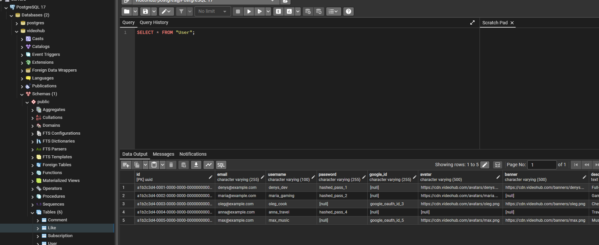
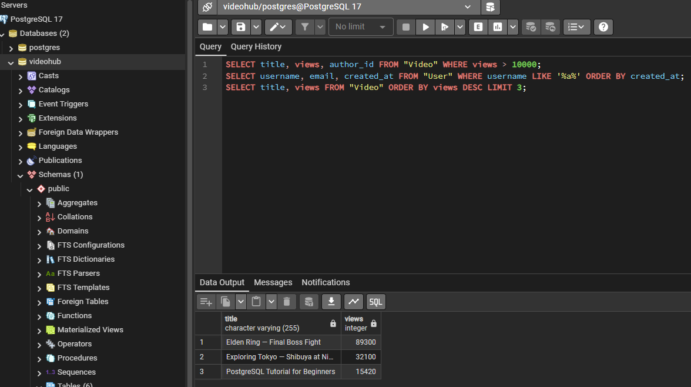
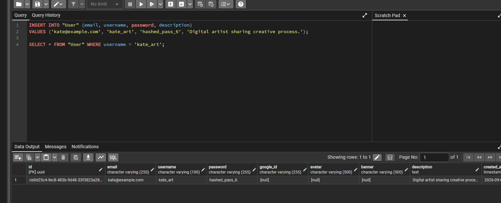
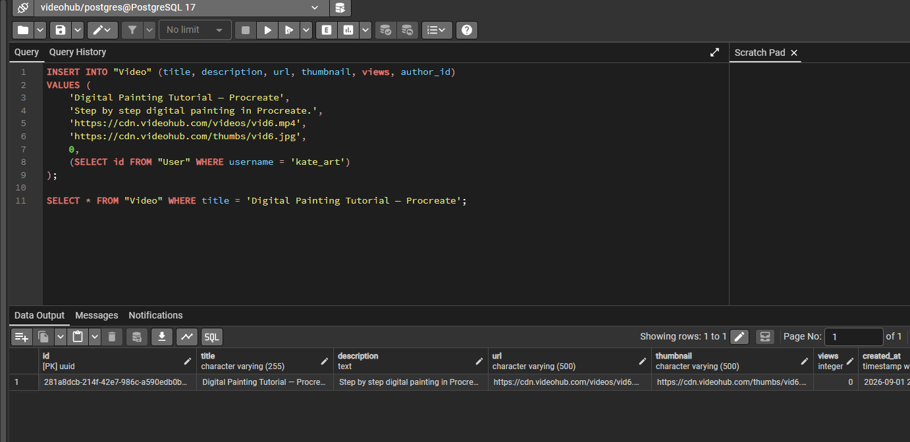
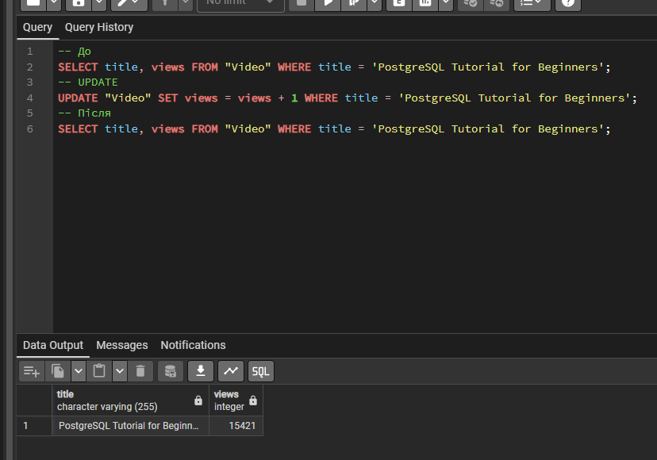
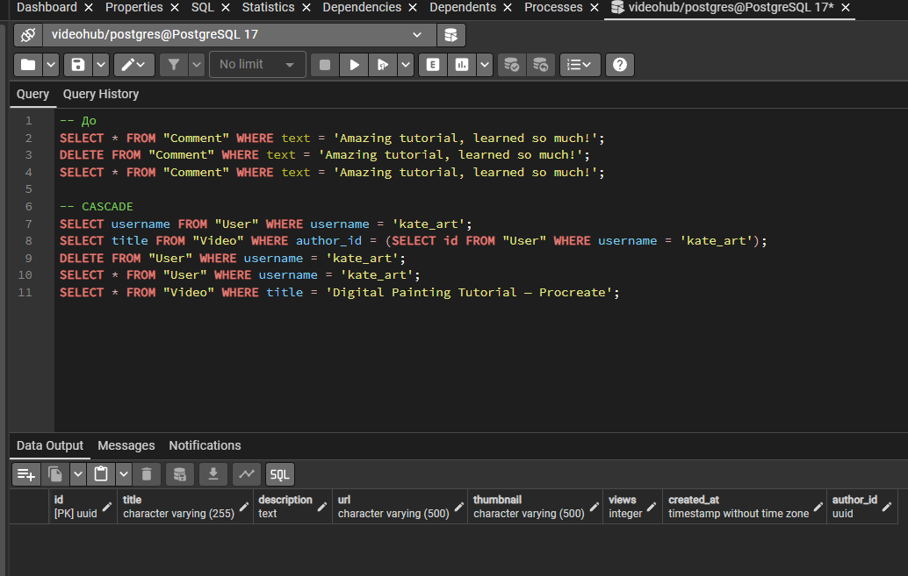

<div style="text-align: center; font-size: 22px; margin-top: 60px;">

Міністерство освіти і науки України

Національний технічний університет України

«Київський політехнічний інститут імені Ігоря Сікорського»

Факультет інформатики та обчислювальної техніки

Кафедра обчислювальної техніки

</div>

<div style="text-align: center; margin-top: 120px;">

<h1 style="font-size: 30px;">Лабораторна робота №3</h1>

<h2 style="font-size: 24px;">з дисципліни «Бази даних»</h2>

</div>

<div style="text-align: right; margin-top: 120px; font-size: 18px;">

<strong>Виконав:</strong><br>
Степаненко Денис<br>
студент групи ІМ-051<br>
номер у списку групи: 16<br><br>

<strong>Перевірив:</strong><br>
Хмельницький Арсеній Андрійович

</div>

<div style="text-align: center; margin-top: 120px; font-size: 22px;">

Київ 2026

</div>

---

## Короткий виклад вимог

**Завдання:**

Використовуючи базу даних VideoHub з Lab 2, виконати базові операції CRUD (Create, Read, Update, Delete) — це операції OLTP (Online Transaction Processing), що виконуються в додатку в реальному часі.

**Що таке CRUD:**

- **C (Create)** — INSERT — додавання нових записів
- **R (Read)** — SELECT — читання даних з фільтрацією, сортуванням, обмеженням
- **U (Update)** — UPDATE — зміна існуючих записів
- **D (Delete)** — DELETE — видалення записів

---

## SELECT (Read)

**1. Вибір усіх даних з таблиці User:**

```sql
SELECT * FROM "User";
```

Зірочка `*` означає «всі колонки». Повертає всі рядки та всі колонки таблиці User.

**2. Вибір конкретних колонок з WHERE — відео з переглядами > 10000:**

```sql
SELECT title, views, author_id FROM "Video" WHERE views > 10000;
```

Вибираємо тільки колонки title, views, author_id. Умова `WHERE views > 10000` фільтрує відео з більш ніж 10000 переглядами.

**3. Вибір з сортуванням та LIKE:**

```sql
SELECT username, email, created_at FROM "User" WHERE username LIKE '%a%' ORDER BY created_at;
```

`LIKE '%a%'` — пошук за шаблоном: username містить літеру 'a' (відсоток = будь-яка кількість символів до та після). `ORDER BY created_at` — сортування за датою створення (за зростанням).

**4. Вибір з LIMIT — топ-3 відео за переглядами:**

```sql
SELECT title, views FROM "Video" ORDER BY views DESC LIMIT 3;
```

`ORDER BY views DESC` — сортування за спаданням (найбільше переглядів першими). `LIMIT 3` — тільки перші 3 рядки.

---

## INSERT (Create)

**1. Додати нового користувача:**

```sql
INSERT INTO "User" (email, username, password, description)
VALUES ('kate@example.com', 'kate_art', 'hashed_pass_6', 'Digital artist sharing creative process.');
```

Вказуємо тільки обов'язкові поля (email, username, password, description). Поле `id` генерується автоматично через `DEFAULT uuid_generate_v4()`, поле `created_at` — через `DEFAULT now()`.

**Перевірка:**

```sql
SELECT * FROM "User" WHERE username = 'kate_art';
```

**2. Додати нове відео:**

```sql
INSERT INTO "Video" (title, description, url, thumbnail, views, author_id)
VALUES (
    'Digital Painting Tutorial — Procreate',
    'Step by step digital painting in Procreate.',
    'https://cdn.videohub.com/videos/vid6.mp4',
    'https://cdn.videohub.com/thumbs/vid6.jpg',
    0,
    (SELECT id FROM "User" WHERE username = 'kate_art')
);
```

`author_id` отримуємо через підзапит — знаходимо id користувача kate_art. Поле `views` = 0 (нове відео).

**Перевірка:**

```sql
SELECT * FROM "Video" WHERE title = 'Digital Painting Tutorial — Procreate';
```

**3. Додати новий коментар:**

```sql
INSERT INTO "Comment" (text, user_id, video_id)
VALUES (
    'Amazing tutorial, learned so much!',
    (SELECT id FROM "User" WHERE username = 'denys_dev'),
    (SELECT id FROM "Video" WHERE title = 'Digital Painting Tutorial — Procreate')
);
```

Підзапити для user_id та video_id — знаходимо ID користувача denys_dev та ID нового відео.

**Перевірка:**

```sql
SELECT * FROM "Comment" WHERE text = 'Amazing tutorial, learned so much!';
```

---

## UPDATE

**1. Збільшити лічильник переглядів відео на 1:**

```sql
-- До
SELECT title, views FROM "Video" WHERE title = 'PostgreSQL Tutorial for Beginners';

-- UPDATE
UPDATE "Video" SET views = views + 1 WHERE title = 'PostgreSQL Tutorial for Beginners';

-- Після
SELECT title, views FROM "Video" WHERE title = 'PostgreSQL Tutorial for Beginners';
```

`SET views = views + 1` — збільшує поточне значення на 1. `WHERE` вказує який саме рядок оновити. Без WHERE — оновились би всі рядки таблиці.

**2. Змінити description користувача:**

```sql
-- До
SELECT username, description FROM "User" WHERE username = 'maria_gaming';

-- UPDATE
UPDATE "User" SET description = 'Gaming streamer. RPGs, indie games, and horror games.' WHERE username = 'maria_gaming';

-- Після
SELECT username, description FROM "User" WHERE username = 'maria_gaming';
```

`SET description = '...'` — замінює значення description. `WHERE username = 'maria_gaming'` — фільтр для конкретного користувача.

---

## DELETE

**1. Видалити коментар (просте видалення):**

```sql
-- До
SELECT * FROM "Comment" WHERE text = 'Amazing tutorial, learned so much!';

-- DELETE
DELETE FROM "Comment" WHERE text = 'Amazing tutorial, learned so much!';

-- Після
SELECT * FROM "Comment" WHERE text = 'Amazing tutorial, learned so much!';
```

Таблиця Comment не має дочірніх таблиць, що посилаються на неї — тому видалення проходить без помилок. `WHERE` вказує який рядок видалити. Без WHERE — видалились би всі рядки.

**2. Видалити користувача з відео — перевірка CASCADE:**

```sql
-- До: показуємо користувача та його відео
SELECT username FROM "User" WHERE username = 'kate_art';
SELECT title FROM "Video" WHERE author_id = (SELECT id FROM "User" WHERE username = 'kate_art');

-- DELETE: видаляємо користувача → CASCADE видаляє відео
DELETE FROM "User" WHERE username = 'kate_art';

-- Після: користувача немає, відео теж немає (CASCADE)
SELECT * FROM "User" WHERE username = 'kate_art';
SELECT * FROM "Video" WHERE title = 'Digital Painting Tutorial — Procreate';
```

При видаленні користувача kate_art автоматично видаляється його відео 'Digital Painting Tutorial — Procreate' через `ON DELETE CASCADE` на зовнішньому ключі `Video.author_id → User.id`. Це демонструє каскадне видалення — основну перевагу правильно налаштованих FK.

---

## Скріншоти

SELECT — вибір усіх користувачів:

<div style="text-align: center;">



</div>

SELECT — відео з переглядами > 10000:

<div style="text-align: center;">

 10000" style="width: 100%; max-width: 800px;">

</div>

INSERT — додавання нового користувача та перевірка:

<div style="text-align: center;">



</div>

INSERT — додавання нового відео та перевірка:

<div style="text-align: center;">



</div>

UPDATE — збільшення переглядів (до та після):

<div style="text-align: center;">



</div>

DELETE — видалення користувача з CASCADE:

<div style="text-align: center;">



</div>

---

## Будь які припущення чи обмеження

- Усі операції виконуються в базі даних `videohub`, створеній у Lab 2.

- Підзапити в INSERT використовуються для отримання ID користувача та відео за відомими значеннями (username, title). У реальному додатку ID передаються напряму з коду.

- UPDATE завжди виконується з WHERE — без WHERE оновляться всі рядки таблиці, що може призвести до втрати даних.

- DELETE завжди виконується з WHERE — без WHERE видаляться всі рядки. Для повного очищення таблиці використовується TRUNCATE.

- CASCADE при DELETE User автоматично видаляє всі пов'язані записи (Video, Comment, Like, Subscription). Це запобігає «сиротам» — записам з неіснуючим FK.

- LIKE '%a%' — пошук без урахування регістру в PostgreSQL не працює за замовчуванням. Для case-insensitive пошуку використовується ILIKE.

- LIMIT 3 повертає максимум 3 рядки. Якщо менше 3 відео — поверне стільки, скільки є.
