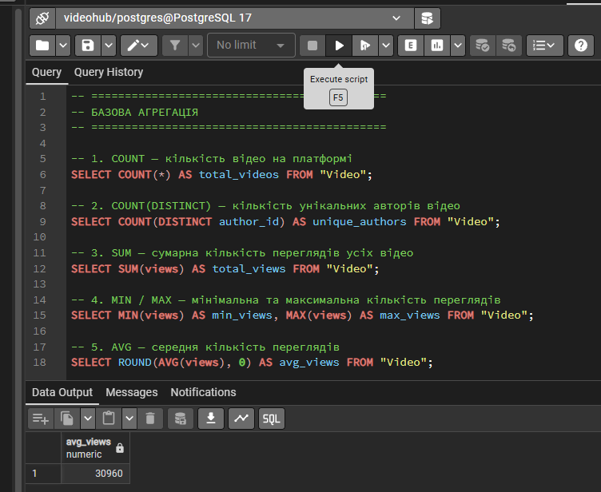
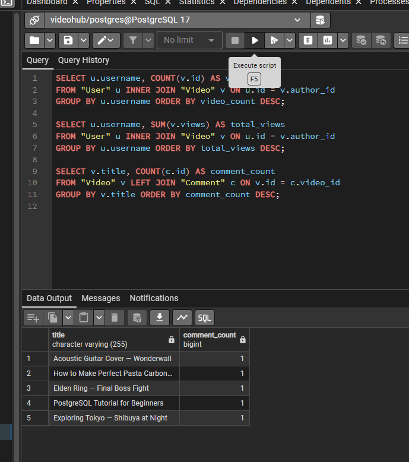
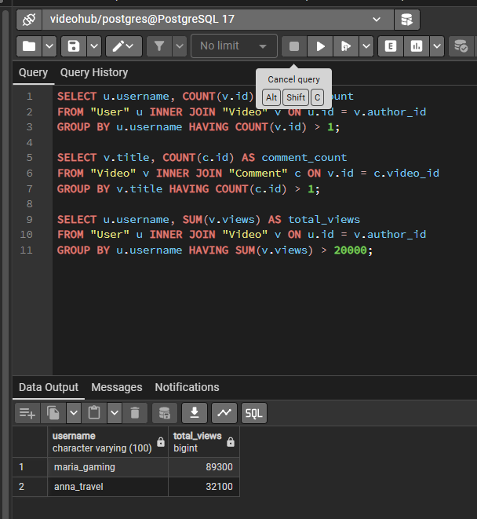
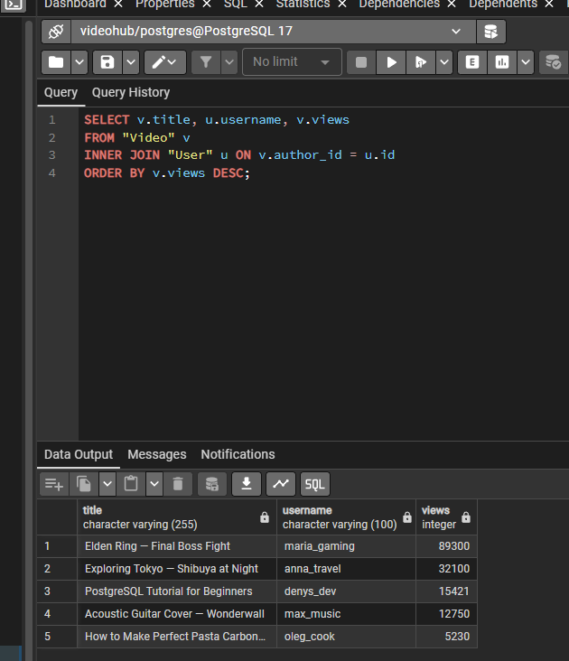
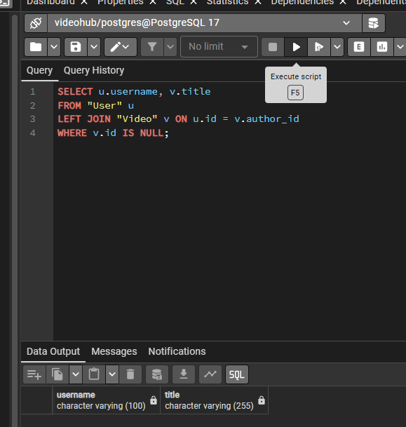
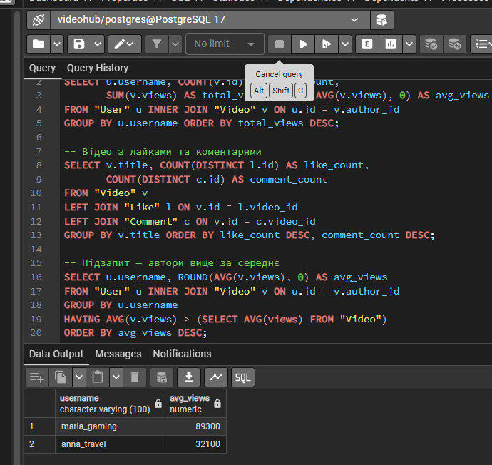

<div style="text-align: center; font-size: 22px; margin-top: 60px;">

Міністерство освіти і науки України

Національний технічний університет України

«Київський політехнічний інститут імені Ігоря Сікорського»

Факультет інформатики та обчислювальної техніки

Кафедра обчислювальної техніки

</div>

<div style="text-align: center; margin-top: 120px;">

<h1 style="font-size: 30px;">Лабораторна робота №4</h1>

<h2 style="font-size: 24px;">з дисципліни «Бази даних»</h2>

</div>

<div style="text-align: right; margin-top: 120px; font-size: 18px;">

<strong>Виконав:</strong><br>
Степаненко Денис<br>
студент групи ІМ-051<br>
номер у списку групи: 16<br><br>

<strong>Перевірив:</strong><br>
Русінов В.В.

</div>

<div style="text-align: center; margin-top: 120px; font-size: 22px;">

Київ 2026

</div>

---

## Короткий виклад вимог

**Завдання:**

Використовуючи базу даних VideoHub з Lab 2, виконати аналітичні запити (OLAP — Online Analytical Processing). OLAP-запити призначені для аналізу даних: агрегація, групування, фільтрація груп, з'єднання таблиць.

**Що таке OLAP:**

OLAP — аналітична обробка даних. На відміну від OLTP (Lab 3), де ми працюємо з одним рядком, OLAP працює з усією таблицею або групами рядків. Приклади: скільки відео на платформі, топ авторів, середні перегляди, відео з найбільшою кількістю коментарів.

**Поняття:**

- **Агрегатні функції** — COUNT, SUM, AVG, MIN, MAX — обчислюють одне значення з множини рядків
- **GROUP BY** — групування рядків за значенням колонки
- **HAVING** — фільтрація груп (на відміну від WHERE, який фільтрує рядки до групування)
- **JOIN** — з'єднання таблиць за спільною колонкою (FK)

---

## Базова агрегація

Агрегатні функції обчислюють одне значення з множини рядків. Використовуються без GROUP BY — тоді вся таблиця є однією групою.

**1. COUNT — кількість відео на платформі:**

```sql
SELECT COUNT(*) AS total_videos FROM "Video";
```

`COUNT(*)` — підраховує всі рядки, включаючи NULL. `AS total_videos` — псевдонім колонки в результаті.

**2. COUNT(DISTINCT) — кількість унікальних авторів:**

```sql
SELECT COUNT(DISTINCT author_id) AS unique_authors FROM "Video";
```

`DISTINCT` — прибирає дублікати. Якщо один автор має 3 відео, він порахується один раз.

**3. SUM — сумарна кількість переглядів:**

```sql
SELECT SUM(views) AS total_views FROM "Video";
```

`SUM` — додає значення всіх рядків. Повертає суму переглядів усіх відео.

**4. MIN / MAX — мінімальна та максимальна кількість переглядів:**

```sql
SELECT MIN(views) AS min_views, MAX(views) AS max_views FROM "Video";
```

`MIN` — найменше значення, `MAX` — найбільше. Можна використовувати кілька агрегатних функцій в одному запиті.

**5. AVG — середня кількість переглядів:**

```sql
SELECT ROUND(AVG(views), 0) AS avg_views FROM "Video";
```

`AVG` — середнє арифметичне. `ROUND(x, 0)` — округлення до цілого (AVG повертає число з плаваючою крапкою).

---

## Групування (GROUP BY)

GROUP BY групує рядки за значенням вказаної колонки. Агрегатні функції застосовуються до кожної групи окремо.

**1. Кількість відео кожного автора:**

```sql
SELECT u.username, COUNT(v.id) AS video_count
FROM "User" u
INNER JOIN "Video" v ON u.id = v.author_id
GROUP BY u.username
ORDER BY video_count DESC;
```

З'єднуємо User та Video, групуємо за username, рахуємо кількість відео кожного автора. `ORDER BY video_count DESC` — сортування за спаданням (більше відео — першими).

**2. Сумарні перегляди за автором:**

```sql
SELECT u.username, SUM(v.views) AS total_views
FROM "User" u
INNER JOIN "Video" v ON u.id = v.author_id
GROUP BY u.username
ORDER BY total_views DESC;
```

Для кожного автора — сума переглядів усіх його відео. Показує хто найпопулярніший.

**3. Кількість коментарів для кожного відео:**

```sql
SELECT v.title, COUNT(c.id) AS comment_count
FROM "Video" v
LEFT JOIN "Comment" c ON v.id = c.video_id
GROUP BY v.title
ORDER BY comment_count DESC;
```

`LEFT JOIN` — щоб включити відео без коментарів (comment_count = 0). `COUNT(c.id)` — рахує тільки непорожні id (NULL не рахує).

---

## Фільтрування груп (HAVING)

HAVING фільтрує групи після GROUP BY. На відміну від WHERE, який фільтрує рядки до групування, HAVING фільтрує результати агрегатних функцій.

**1. Автори з більш ніж 1 відео:**

```sql
SELECT u.username, COUNT(v.id) AS video_count
FROM "User" u
INNER JOIN "Video" v ON u.id = v.author_id
GROUP BY u.username
HAVING COUNT(v.id) > 1;
```

`HAVING COUNT(v.id) > 1` — залишає тільки авторів з 2+ відео. WHERE не може використовувати агрегатні функції — для цього потрібен HAVING.

**2. Відео з більш ніж 1 коментарем:**

```sql
SELECT v.title, COUNT(c.id) AS comment_count
FROM "Video" v
INNER JOIN "Comment" c ON v.id = c.video_id
GROUP BY v.title
HAVING COUNT(c.id) > 1;
```

Залишає тільки відео з 2+ коментарями. INNER JOIN виключає відео без коментарів.

**3. Автори з сумарними переглядами > 20000:**

```sql
SELECT u.username, SUM(v.views) AS total_views
FROM "User" u
INNER JOIN "Video" v ON u.id = v.author_id
GROUP BY u.username
HAVING SUM(v.views) > 20000;
```

`HAVING SUM(v.views) > 20000` — залишає тільки авторів з сумою переглядів понад 20000.

**WHERE vs HAVING:**

- WHERE — фільтрує рядки ДО групування (наприклад, `WHERE views > 1000`)
- HAVING — фільтрує групи ПІСЛЯ групування (наприклад, `HAVING SUM(views) > 20000`)
- Можна використовувати обидва: WHERE фільтрує вхідні дані, HAVING — результати агрегації

---

## JOIN

JOIN з'єднує таблиці за спільною колонкою (зазвичай FK). Дозволяє отримати дані з кількох таблиць в одному запиті.

**1. INNER JOIN — відео з іменами авторів:**

```sql
SELECT v.title, u.username, v.views
FROM "Video" v
INNER JOIN "User" u ON v.author_id = u.id
ORDER BY v.views DESC;
```

`INNER JOIN` — залишає тільки рядки, які мають відповідник в обох таблицях. Відео без автора (неможливо через FK) та автори без відео не потрапляють в результат. `ON v.author_id = u.id` — умова з'єднання (FK = PK).

**2. LEFT JOIN — користувачі без відео:**

```sql
SELECT u.username, v.title
FROM "User" u
LEFT JOIN "Video" v ON u.id = v.author_id
WHERE v.id IS NULL;
```

`LEFT JOIN` — залишає всі рядки з лівої таблиці (User), навіть без відповідника в правій (Video). `WHERE v.id IS NULL` — фільтрує тільки користувачів без відео (колонки з Video будуть NULL).

**3. FULL OUTER JOIN — усі користувачі та всі відео:**

```sql
SELECT u.username, v.title
FROM "User" u
FULL OUTER JOIN "Video" v ON u.id = v.author_id
ORDER BY u.username NULLS LAST;
```

`FULL OUTER JOIN` — залишає всі рядки з обох таблиць. Користувачі без відео (title = NULL) та відео без автора (username = NULL, неможливо через FK). `NULLS LAST` — NULL значення в кінці сортування.

**4. CROSS JOIN — всі комбінації користувачів та відео:**

```sql
SELECT u.username, v.title
FROM "User" u
CROSS JOIN "Video" v
ORDER BY u.username, v.title
LIMIT 10;
```

`CROSS JOIN` — декартовий добуток: кожен користувач × кожне відео. Якщо 5 користувачів та 5 відео — 25 рядків. `LIMIT 10` — обмежує вивід. Використовується рідко, наприклад для генерації всіх можливих комбінацій (potential audience analysis).

**Типи JOIN коротко:**

- **INNER JOIN** — тільки рядки з відповідником в обох таблицях
- **LEFT JOIN** — всі рядки з лівої таблиці + відповідники з правої (NULL якщо немає)
- **RIGHT JOIN** — всі рядки з правої таблиці + відповідники з лівої
- **FULL OUTER JOIN** — всі рядки з обох таблиць (NULL де немає відповідника)
- **CROSS JOIN** — декартовий добуток (кожен з кожним)

---

## Багатотаблична агрегація

**1. Топ авторів за сумарними переглядами:**

```sql
SELECT u.username,
       COUNT(v.id) AS video_count,
       SUM(v.views) AS total_views,
       ROUND(AVG(v.views), 0) AS avg_views
FROM "User" u
INNER JOIN "Video" v ON u.id = v.author_id
GROUP BY u.username
ORDER BY total_views DESC;
```

JOIN + 3 агрегатні функції + GROUP BY. Для кожного автора: кількість відео, сума переглядів, середні перегляди. Сортування за сумою переглядів.

**2. Відео з кількістю лайків та коментарів:**

```sql
SELECT v.title,
       COUNT(DISTINCT l.id) AS like_count,
       COUNT(DISTINCT c.id) AS comment_count
FROM "Video" v
LEFT JOIN "Like" l ON v.id = l.video_id
LEFT JOIN "Comment" c ON v.id = c.video_id
GROUP BY v.title
ORDER BY like_count DESC, comment_count DESC;
```

Два LEFT JOIN (Like + Comment) до Video. `COUNT(DISTINCT ...)` — щоб уникнути дублів при множинних JOIN. Сортування спочатку за лайками, потім за коментарями.

**3. Підзапит — автори з середнім переглядом вищим за загальний:**

```sql
SELECT u.username, ROUND(AVG(v.views), 0) AS avg_views
FROM "User" u
INNER JOIN "Video" v ON u.id = v.author_id
GROUP BY u.username
HAVING AVG(v.views) > (SELECT AVG(views) FROM "Video")
ORDER BY avg_views DESC;
```

Підзапит `(SELECT AVG(views) FROM "Video")` обчислює загальний середній перегляд. HAVING порівнює середній перегляд автора із загальним. Повертає тільки авторів, які вищі за середнє.

---

## Скріншоти

Базова агрегація — COUNT, SUM, MIN, MAX, AVG:

<div style="text-align: center;">



</div>

GROUP BY — кількість відео та перегляди за автором:

<div style="text-align: center;">



</div>

HAVING — автори з більш ніж 1 відео:

<div style="text-align: center;">



</div>

INNER JOIN — відео з іменами авторів:

<div style="text-align: center;">



</div>

LEFT JOIN — користувачі без відео:

<div style="text-align: center;">



</div>

Багатотаблична агрегація — топ авторів + підзапит:

<div style="text-align: center;">



</div>

---

## Будь які припущення чи обмеження

- Усі запити виконуються в базі даних `videohub`, створеній у Lab 2.

- `COUNT(*)` рахує всі рядки включаючи NULL, `COUNT(column)` рахує тільки непорожні значення. `COUNT(DISTINCT column)` — унікальні непорожні значення.

- `ROUND(AVG(x), 0)` округлює середнє до цілого. Без ROUND — число з плаваючою крапкою (наприклад, 25333.3333333333).

- HAVING застосовується після GROUP BY, WHERE — до. Можна використовувати обидва: WHERE фільтрує вхідні рядки, HAVING — результати агрегації.

- `LEFT JOIN` включає всі рядки з лівої таблиці. Використовується для пошуку записів без відповідника (WHERE right.id IS NULL).

- `CROSS JOIN` створює декартовий добуток — N×M рядків. Використовується рідко, переважно для генерації всіх комбінацій.

- `COUNT(DISTINCT l.id)` у запиті з кількома JOIN потрібен, щоб уникнути дублювання при множинних з'єднаннях (M:N через проміжну таблицю).

- Підзапит у HAVING обчислюється один раз для всього запиту (не кореляційний). Кореляційний підзапит виконується для кожного рядка зовнішнього запиту.

- `NULLS LAST` в ORDER BY — поміщає NULL значення в кінці сортування. За замовчуванням PostgreSQL поміщає NULL першими при ASC.
