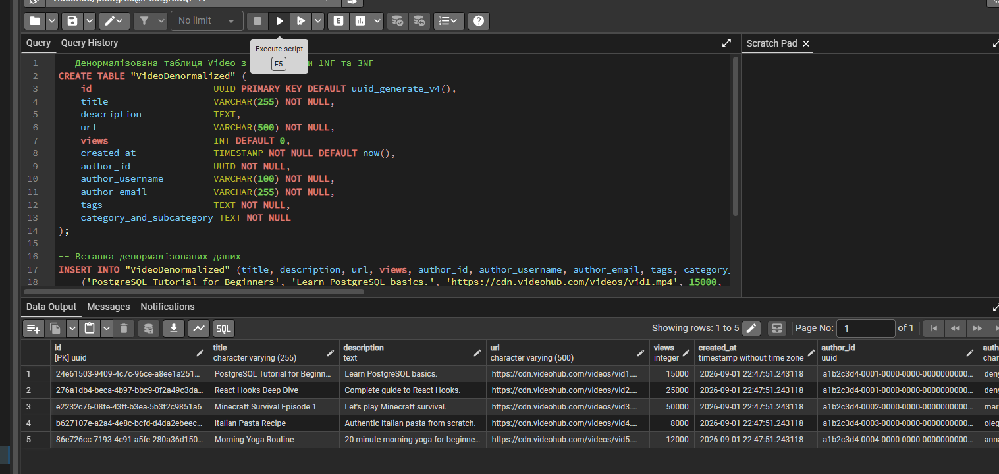
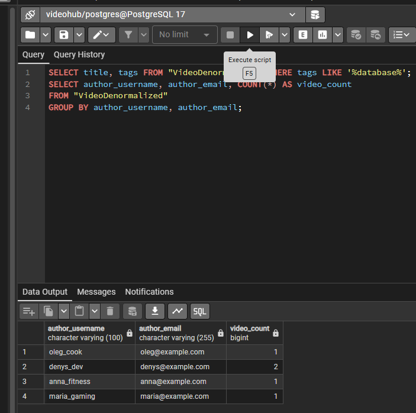
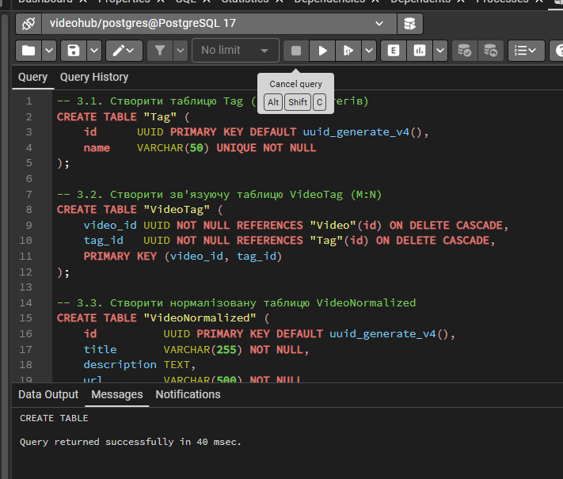
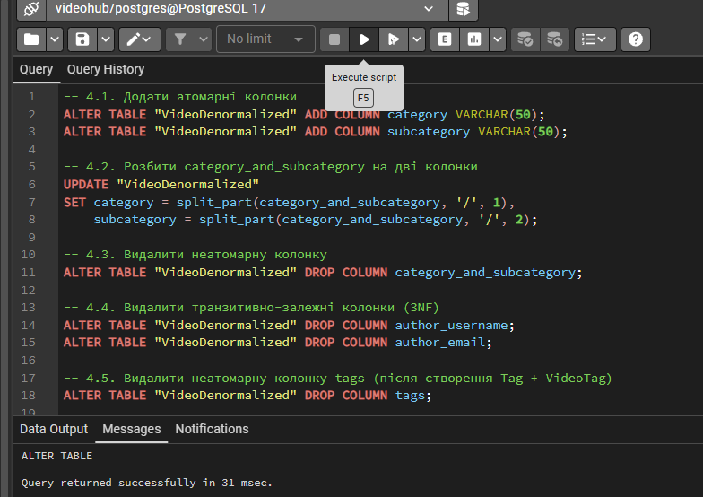
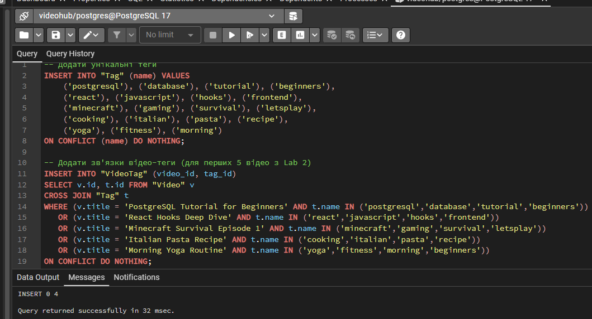
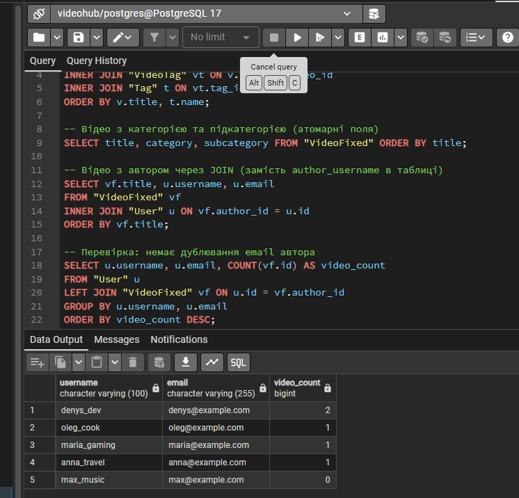

<div style="text-align: center; font-size: 22px; margin-top: 60px;">

Міністерство освіти і науки України

Національний технічний університет України

«Київський політехнічний інститут імені Ігоря Сікорського»

Факультет інформатики та обчислювальної техніки

Кафедра обчислювальної техніки

</div>

<div style="text-align: center; margin-top: 120px;">

<h1 style="font-size: 30px;">Лабораторна робота №5</h1>

<h2 style="font-size: 24px;">з дисципліни «Бази даних»</h2>

</div>

<div style="text-align: right; margin-top: 120px; font-size: 18px;">

<strong>Виконав:</strong><br>
Степаненко Денис<br>
студент групи ІМ-051<br>
номер у списку групи: 16<br><br>

<strong>Перевірив:</strong><br>
Хмельницький Арсеній Андрійович

</div>

<div style="text-align: center; margin-top: 120px; font-size: 22px;">

Київ 2026

</div>

---

## Короткий виклад вимог

**Завдання:**

Провести перевірку та нормалізацію бази даних VideoHub до третьої нормальної форми (3NF). Показати денормалізовану схему з порушеннями, виявити проблеми, виправити через ALTER TABLE.

**Що таке нормалізація:**

Нормалізація — процес організації структури бази даних для усунення надлишковості даних та забезпечення цілісності. Нормальні форми (1NF, 2NF, 3NF) — правила, які гарантують, що схема не має аномалій оновлення, вставки та видалення.

**Три нормальні форми:**

- **1NF (Перша нормальна форма)** — усі атрибути атомарні (неподільні), відсутні повторювані групи
- **2NF (Друга нормальна форма)** — 1NF + неключові атрибути повністю залежать від всього PK (не частково)
- **3NF (Третя нормальна форма)** — 2NF + відсутні транзитивні залежності (неключовий атрибут не залежить від іншого неключового)

---

## Денормалізована схема

Створюємо таблицю `VideoDenormalized` зі спеціальними порушеннями для демонстрації:

```sql
CREATE TABLE "VideoDenormalized" (
    id                      UUID PRIMARY KEY DEFAULT uuid_generate_v4(),
    title                   VARCHAR(255) NOT NULL,
    description             TEXT,
    url                     VARCHAR(500) NOT NULL,
    views                   INT DEFAULT 0,
    created_at              TIMESTAMP NOT NULL DEFAULT now(),
    author_id               UUID NOT NULL,
    author_username         VARCHAR(100) NOT NULL,
    author_email            VARCHAR(255) NOT NULL,
    tags                    TEXT NOT NULL,
    category_and_subcategory TEXT NOT NULL
);
```

**Порушення в цій таблиці:**

1. **`tags TEXT`** — містить кілька тегів через кому (наприклад, `'postgresql,database,tutorial,beginners'`). Це порушення 1NF — значення не атомарне. Неможливо відфільтрувати відео за одним тегом без LIKE або складного парсингу.

2. **`category_and_subcategory TEXT`** — містить два значення через слеш (наприклад, `'Tech/Databases'`). Порушення 1NF — два поняття в одній колонці.

3. **`author_username` та `author_email`** — дублюють дані з таблиці User. Порушення 3NF — транзитивна залежність: `video_id → author_id → username, email`. Якщо користувач змінить email, треба оновити всі його відео.

---

## Перевірка 1NF

**Правила 1NF:**
- Усі атрибути містять лише атомарні (неподільні) значення
- Відсутні повторювані групи атрибутів
- Кожен запис унікальний (забезпечується PK)
- Порядок записів не важливий

**Порушення 1NF у VideoDenormalized:**

1. **`tags`** — `'postgresql,database,tutorial,beginners'` — не атомарне. Один атрибут містить множину значень. Неможливо зробити `WHERE tags = 'database'` — потрібен `LIKE '%database%'`, який знайде також `'database_design'`.

2. **`category_and_subcategory`** — `'Tech/Databases'` — не атомарне. Категорія та підкатегорія — два різні поняття, об'єднані в одне поле.

**Демонстрація проблеми:**

```sql
-- Цей запит працює неправильно — LIKE знайде 'database' в 'database_design'
SELECT title, tags FROM "VideoDenormalized" WHERE tags LIKE '%database%';
```

**Рішення 1NF:**
- Розбити `tags` на окремі таблиці `Tag` + `VideoTag` (M:N зв'язок)
- Розбити `category_and_subcategory` на `category` + `subcategory`

---

## Перевірка 2NF

**Правила 2NF:**
- Таблиця знаходиться в 1NF
- Кожен неключовий атрибут повністю функціонально залежить від всього первинного ключа (не від його частини)

**Аналіз:**

Первинний ключ `VideoDenormalized` — одиночна колонка `id` (UUID). Оскільки PK складається з однієї колонки, часткових залежностей бути не може — кожен неключовий атрибут залежить від всього PK (який дорівнює одній колонці).

**Висновок:** 2NF виконується для всіх таблиць VideoHub, оскільки всі PK — одиночні UUID. 2NF порушується тільки при складених PK (кілька колонок), де атрибут може залежати від частини PK.

---

## Перевірка 3NF

**Правила 3NF:**
- Таблиця знаходиться в 2NF
- Відсутні транзитивні залежності: неключовий атрибут не повинен залежати від іншого неключового атрибута

**Порушення 3NF у VideoDenormalized:**

`author_username` та `author_email` транзитивно залежать від PK через `author_id`:

```
video.id → author_id → author_username, author_email
```

Це транзитивна залежність: `author_username` та `author_email` не залежать напряму від `video.id`, а через `author_id`. Дані автора вже зберігаються в таблиці `User` — дублювання.

**Проблеми транзитивної залежності:**
- **Аномалія оновлення:** якщо користувач змінить email, треба оновити всі рядки в `VideoDenormalized` де він автор
- **Аномалія вставки:** не можна додати користувача без відео (його email ніде не збережеться)
- **Аномалія видалення:** якщо видалити всі відео автора — втратимо його email

**Рішення 3NF:**
- Видалити `author_username` та `author_email` з таблиці відео
- Отримувати дані автора через JOIN з таблицею `User`

---

## Виправлення — нормалізація

### Крок 1: Створення таблиці Tag та VideoTag (M:N)

```sql
CREATE TABLE "Tag" (
    id      UUID PRIMARY KEY DEFAULT uuid_generate_v4(),
    name    VARCHAR(50) UNIQUE NOT NULL
);

CREATE TABLE "VideoTag" (
    video_id UUID NOT NULL REFERENCES "Video"(id) ON DELETE CASCADE,
    tag_id   UUID NOT NULL REFERENCES "Tag"(id) ON DELETE CASCADE,
    PRIMARY KEY (video_id, tag_id)
);
```

Тепер кожен тег — окремий рядок в `Tag`. Зв'язок M:N (відео може мати багато тегів, тег — багато відео) реалізовано через `VideoTag` зі складеним PK `(video_id, tag_id)`.

### Крок 2: ALTER TABLE — розбиття category_and_subcategory

```sql
-- Додати атомарні колонки
ALTER TABLE "VideoDenormalized" ADD COLUMN category VARCHAR(50);
ALTER TABLE "VideoDenormalized" ADD COLUMN subcategory VARCHAR(50);

-- Розбити значення
UPDATE "VideoDenormalized" 
SET category = split_part(category_and_subcategory, '/', 1),
    subcategory = split_part(category_and_subcategory, '/', 2);

-- Видалити неатомарну колонку
ALTER TABLE "VideoDenormalized" DROP COLUMN category_and_subcategory;
```

`split_part(string, delimiter, position)` — функція PostgreSQL для розбиття рядка. `/1` — частина до слеша, `/2` — після.

### Крок 3: ALTER TABLE — видалення транзитивних залежностей

```sql
-- Видалити колонки, що дублюють дані автора (3NF)
ALTER TABLE "VideoDenormalized" DROP COLUMN author_username;
ALTER TABLE "VideoDenormalized" DROP COLUMN author_email;

-- Видалити неатомарну колонку tags
ALTER TABLE "VideoDenormalized" DROP COLUMN tags;

-- Перейменувати таблицю
ALTER TABLE "VideoDenormalized" RENAME TO "VideoFixed";
```

Після цих змін таблиця `VideoFixed` відповідає 3NF:
- Усі атрибути атомарні (1NF)
- Немає часткових залежностей (2NF)
- Немає транзитивних залежностей (3NF)

---

## Перевірка після нормалізації

**Відео з тегами через JOIN (замість tags через кому):**

```sql
SELECT v.title, t.name AS tag
FROM "Video" v
INNER JOIN "VideoTag" vt ON v.id = vt.video_id
INNER JOIN "Tag" t ON vt.tag_id = t.id
ORDER BY v.title, t.name;
```

Тепер можна фільтрувати за конкретним тегом: `WHERE t.name = 'database'` — точно, без LIKE.

**Відео з автором через JOIN (замість author_username в таблиці):**

```sql
SELECT vf.title, u.username, u.email
FROM "VideoFixed" vf
INNER JOIN "User" u ON vf.author_id = u.id
ORDER BY vf.title;
```

Дані автора отримуємо з `User` через JOIN — немає дублювання. Якщо користувач змінить email — оновлюємо один рядок в `User`, а не всі відео.

---

## Скріншоти

КРОК 1 — денормалізована схема (CREATE TABLE + INSERT + SELECT):

<div style="text-align: center;">



</div>

КРОК 2 — аналіз порушень (проблема 1NF з LIKE, дублювання 3NF):

<div style="text-align: center;">



</div>

КРОК 3 — створення нормалізованих таблиць (Tag, VideoTag, VideoNormalized):

<div style="text-align: center;">



</div>

КРОК 4 — ALTER TABLE (додати колонки, розбити, видалити, перейменувати):

<div style="text-align: center;">



</div>

КРОК 5 — заповнення таблиць Tag та VideoTag:

<div style="text-align: center;">



</div>

КРОК 6 — перевірка після нормалізації (SELECT з JOIN):

<div style="text-align: center;">



</div>

---

## Будь які припущення чи обмеження

- Денормалізована таблиця `VideoDenormalized` створюється спеціально для демонстрації порушень. В реальному проєкті VideoHub схема з Lab 2 вже нормалізована.

- `split_part(string, delimiter, position)` — функція PostgreSQL для розбиття рядка. Повертає частину рядка за індексом (1-based).

- Таблиця `VideoTag` має складений PK `(video_id, tag_id)` — це єдиний випадок складеного PK у схемі. 2NF для цієї таблиці виконується, оскільки немає неключових атрибутів (тільки дві колонки FK, які разом утворюють PK).

- `ON CONFLICT (name) DO NOTHING` в INSERT до Tag — запобігає дублюванню тегів. Якщо тег вже існує — пропускає.

- `ON DELETE CASCADE` на VideoTag — при видаленні відео автоматично видаляються його зв'язки з тегами.

- Нормалізація зменшує надлишковість даних, але може збільшити кількість JOIN у запитах. Це компроміс між цілісністю даних та продуктивністю.

- У реальному проєкті VideoHub (Prisma) теги не реалізовані — це допущення для демонстрації нормалізації. Категорія та підкатегорія також додані для лаби.

- Денормалізація іноді використовується навмисно для продуктивності (наприклад, кешування даних автора у відео для зменшення JOIN). Але це компроміс — ризик аномалій оновлення.
